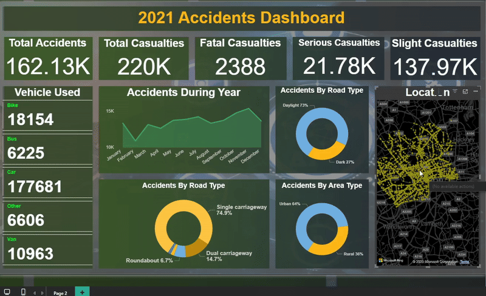

# 🚗 UK Road Accidents Analytics Dashboard (2021)

A comprehensive data analytics project analyzing road traffic accidents across the United Kingdom in 2021. This project features extensive data cleaning, processing, and visualization through an interactive Power BI dashboard designed to support road safety initiatives and policy-making decisions.



## 🎯 Project Overview

This project provides deep insights into road accident patterns, severity, and contributing factors across the UK during 2021. Through careful data processing and interactive visualizations, it enables stakeholders to identify accident hotspots, understand casualty trends, and develop targeted road safety interventions.

## ✨ Key Features

- **Interactive Power BI Dashboard**: Dynamic visualizations with advanced filtering capabilities
- **Comprehensive Dataset**: Cleaned and processed UK road accident data from 2021
- **Multi-dimensional Analysis**: Examine accidents by location, time, severity, weather, and road conditions
- **Casualty Insights**: Detailed breakdown of casualties by type and severity
- **Geographic Mapping**: Visual representation of accident distributions across regions
- **Temporal Patterns**: Identify peak accident times and seasonal trends

## 📊 Dashboard Insights

### Key Performance Indicators (KPIs)
- **Total Accidents**: Overall count of road incidents in 2021
- **Total Casualties**: Number of people affected
- **Fatal Casualties**: Severe accidents resulting in fatalities
- **Serious Casualties**: Major injuries requiring medical attention
- **Slight Casualties**: Minor injuries
- **Accident Severity Rate**: Distribution of accident severity levels

### Analytical Dimensions

#### 1. **Temporal Analysis**
- Accidents by month and season
- Day of week patterns
- Time of day distribution
- Peak accident hours
- Year-over-year comparisons (if multi-year data available)

#### 2. **Geographic Analysis**
- Regional distribution of accidents
- Urban vs. rural accident rates
- High-risk locations and accident hotspots
- Local authority area comparisons

#### 3. **Road & Environmental Conditions**
- Weather conditions (clear, rain, fog, snow)
- Road surface conditions (dry, wet, icy)
- Light conditions (daylight, darkness, street lighting)
- Road type (motorway, A-road, B-road, minor road)

#### 4. **Vehicle & Casualty Analysis**
- Vehicle types involved (car, motorcycle, bicycle, pedestrian)
- Casualty breakdown by type
- Age group distributions
- Severity by vehicle type

#### 5. **Contributing Factors**
- Speed limits at accident locations
- Junction details and types
- Road surface defects
- Special conditions at scene

## 📁 Project Structure

```
RoadAccidentsProj/
├── dashboard.gif              # Dashboard demo animation
├── [Data Files]              # Cleaned UK road accident data (2021)
├── [Power BI File]           # Interactive dashboard (.pbix)
├── [Documentation]           # Data dictionary and metadata
└── README.md                 # Project documentation
```

## 🛠️ Technologies & Tools

- **Power BI Desktop**: Primary visualization and dashboard platform
- **Power Query (M Language)**: Data transformation and ETL processes
- **DAX (Data Analysis Expressions)**: Custom measures and calculations
- **Data Modeling**: Star schema implementation
- **Excel/CSV**: Source data format

## 🚀 Getting Started

### Prerequisites

- **Power BI Desktop** (Version 2.0 or later recommended)
  - Download: [Microsoft Power BI](https://powerbi.microsoft.com/desktop/)
- **Basic understanding of road accident terminology**
- **2GB+ RAM** for smooth dashboard performance

### Installation Steps

1. **Clone the Repository**
   ```bash
   git clone https://github.com/NoahMustafa/RoadAccidentsProj.git
   cd RoadAccidentsProj
   ```

2. **Open the Dashboard**
   - Launch Power BI Desktop
   - Open the `.pbix` file from the repository
   - Wait for data to load (may take a few moments for large datasets)

3. **Explore the Dashboard**
   - Navigate through different report pages
   - Use slicers to filter by date, location, and conditions
   - Hover over visuals for detailed tooltips
   - Click on charts to cross-filter related visuals

4. **Refresh Data** (Optional)
   - If you have updated source data
   - Click "Refresh" in Power BI to update visuals

## 📋 Data Processing Pipeline

### Data Sources
- **UK Department for Transport**: Official road accident statistics
- **Coverage Period**: Calendar year 2021
- **Geographic Scope**: United Kingdom (England, Scotland, Wales, Northern Ireland)

### Data Cleaning Process

1. **Data Quality Assessment**
   - Identified missing values and inconsistencies
   - Validated data types and formats
   - Checked for logical errors and outliers

2. **Data Transformation**
   - Standardized location names and codes
   - Converted date/time formats
   - Created categorical hierarchies
   - Normalized text fields

3. **Data Enhancement**
   - Added calculated columns for analysis
   - Created date dimension table
   - Established geographic hierarchies
   - Generated severity classifications

4. **Data Validation**
   - Cross-referenced with official statistics
   - Ensured data integrity and accuracy
   - Documented all transformation steps

### Key Data Fields
- Accident Index (Unique Identifier)
- Date and Time
- Location Details (Lat/Long, Local Authority)
- Accident Severity
- Number of Casualties
- Vehicle Types
- Weather Conditions
- Road Surface Conditions
- Speed Limit
- Light Conditions
- Road Type
- Junction Details

## 💡 Use Cases & Applications

### For Government & Policy Makers
- Identify high-risk areas requiring infrastructure improvements
- Evaluate effectiveness of road safety policies
- Allocate resources for accident prevention programs
- Develop targeted public awareness campaigns

### For Law Enforcement
- Deploy traffic officers to accident-prone locations
- Focus enforcement on high-risk times and conditions
- Plan seasonal safety operations

### For Urban Planners
- Design safer road networks
- Improve junction layouts and signage
- Implement traffic calming measures
- Optimize street lighting placement

### For Researchers & Analysts
- Study accident causation patterns
- Conduct statistical analysis of risk factors
- Develop predictive models
- Publish road safety research

### For Insurance Companies
- Assess risk profiles by location and conditions
- Develop data-driven premium calculations
- Identify fraud patterns

## 📈 Key Insights & Findings

Based on 2021 UK road accident data, the dashboard reveals:

- **Temporal Patterns**: Peak accident periods and seasonal variations
- **Geographic Hotspots**: Areas with highest accident concentrations
- **Weather Impact**: Correlation between weather conditions and severity
- **Vehicle Analysis**: Most vulnerable road user groups
- **Severity Trends**: Distribution of fatal, serious, and slight casualties

*Note: Specific statistics should be derived from the actual dashboard*

## 🔧 Customization Guide

### Adapting for Different Datasets

1. **Update Data Source**
   - Replace with your accident data (ensure similar structure)
   - Maintain key columns: Date, Location, Severity, Casualties

2. **Modify Geographic Boundaries**
   - Update region/area filters for different countries
   - Adjust map visualizations for new territories

3. **Customize Time Periods**
   - Extend date range for multi-year analysis
   - Adjust time intelligence calculations

4. **Add New Metrics**
   - Create custom DAX measures
   - Include additional KPIs relevant to your analysis

## 🎨 Dashboard Design Principles

- **Clean Layout**: Minimal clutter for easy interpretation
- **Consistent Color Scheme**: Red for fatal, amber for serious, green for slight
- **Intuitive Navigation**: Logical flow between report pages
- **Interactive Elements**: Cross-filtering for deeper exploration
- **Mobile Responsive**: Optimized for various screen sizes
- **Accessible Design**: High contrast and readable fonts

## 📊 Technical Implementation

### DAX Measures Examples
```dax
Total Accidents = COUNTROWS('Accidents')

Fatal Casualties = 
CALCULATE(
    SUM('Casualties'[Number]),
    'Casualties'[Severity] = "Fatal"
)

YoY Growth = 
VAR CurrentYear = [Total Accidents]
VAR PreviousYear = CALCULATE([Total Accidents], DATEADD('Date'[Date], -1, YEAR))
RETURN DIVIDE(CurrentYear - PreviousYear, PreviousYear)
```


## ⚖️ License & Attribution

**Important Notice**: This dashboard and its contents are protected. 

### Usage Terms
- ✅ **Permitted**: View, learn from, and fork for personal learning
- ❌ **Prohibited**: Republish, redistribute, or claim as your own work
- ✅ **Required**: Always credit the original author

### Proper Attribution
If referencing this work, please use:
```
Road Accidents Dashboard (UK 2021)
Created by: Noah Mustafa
Source: https://github.com/NoahMustafa/RoadAccidentsProj
```

**Do not take the dashboard and reuse it without proper attribution!**

## 📚 Data Sources & References

- **UK Department for Transport**: [Official Road Safety Statistics](https://www.gov.uk/government/collections/road-accidents-and-safety-statistics)
- **UK Government Open Data**: Public sector information licensed under Open Government Licence
- **Office for National Statistics**: UK geographic and demographic data

## 🔐 Data Privacy & Ethics

- All data used is **publicly available** and aggregated
- **No personal information** is included or displayed
- Data is used solely for **statistical and analytical purposes**
- Complies with **UK data protection** regulations

## 📧 Contact & Support

**Noah Mustafa**

- 🐙 GitHub: [@NoahMustafa](https://github.com/NoahMustafa)
- 🔗 Project Link: [RoadAccidentsProj](https://github.com/NoahMustafa/RoadAccidentsProj)
- 💬 Issues: [Report a Problem](https://github.com/NoahMustafa/RoadAccidentsProj/issues)

## 🙏 Acknowledgments

- UK Department for Transport for providing comprehensive road safety data
- Power BI community for visualization best practices
- Road safety organizations working to make UK roads safer
- Open-source contributors and data visualization enthusiasts

## 🗺️ Future Enhancements

### Planned Features
- [ ] Multi-year comparative analysis (2019-2023)
- [ ] Predictive analytics for accident risk forecasting
- [ ] Integration with real-time traffic data
- [ ] Advanced geospatial clustering analysis
- [ ] Machine learning models for severity prediction
- [ ] Automated monthly report generation
- [ ] Mobile app companion for field analysis
- [ ] API integration for live data updates
- [ ] Enhanced drill-through capabilities
- [ ] Export functionality for custom reports

### Potential Extensions
- Integration with weather APIs for real-time conditions
- Comparison with European road safety statistics
- Analysis of road infrastructure investments' impact
- Public participation features for citizen reporting

## 📊 Performance Metrics

- **Data Rows**: ~100,000+ accident records
- **Dashboard Load Time**: < 5 seconds
- **Visual Elements**: 20+ interactive components
- **Filter Options**: 50+ distinct filtering capabilities
- **Export Formats**: PDF, PowerPoint, Excel

## 🎓 Learning Resources

Want to learn more about road safety data analysis?

- [Road Safety Data Visualization Best Practices](https://www.gov.uk/government/statistics)
- [Power BI for Public Sector Analytics](https://powerbi.microsoft.com/industries/government/)
- [Understanding Road Accident Statistics](https://www.rospa.com/road-safety)

---

## 🌟 Project Impact

This dashboard serves as a **valuable tool for road safety professionals** and demonstrates the power of data visualization in addressing real-world public safety challenges. By making accident data accessible and understandable, we can collectively work towards **safer roads for everyone**.

---

⭐ **If you find this project valuable, please give it a star!**

🚦 **Together, we can make roads safer through data-driven insights.**

---

*Last Updated: October 2025*  
*Data Period: Calendar Year 2021*  
*Geographic Coverage: United Kingdom*
